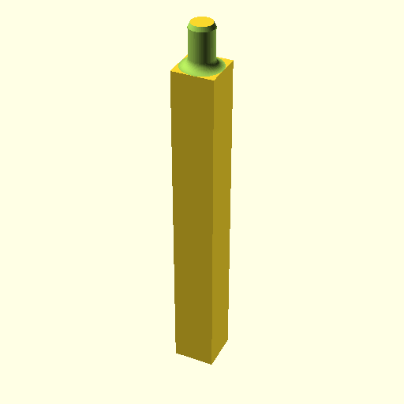
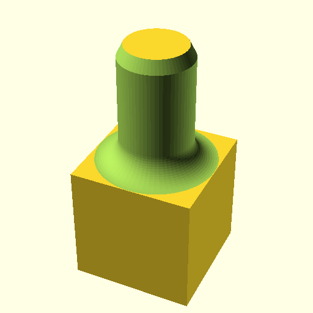
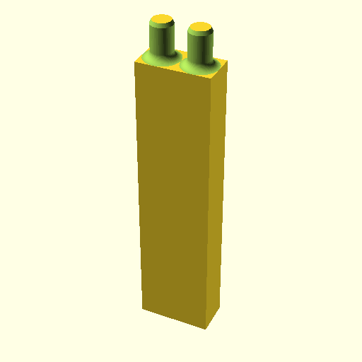

Stackie-Shelfie: a stackable, 3D-printable shelf system
=======================================================

The problem
-----------

Too many little things that should be organized better.

I wanted some kind of pluggable system with lots of different types of
parts that all somehow can be plugged into each other, and that also can
be taken apart again.

It should be sturdier than Lego.

Oh, and I own a 3D printer.

The solution
------------

Here's an example:

The principles
--------------

Everything is metric, with the basic unit being a cube that's 10mm wide.
Everything is a multiple of that basic unit, except that shelves are half
that to save on material.

The basic connector is a cylinder that slides through and into other parts.
On my printer, the defaults work so that the parts don't fall apart, even
without glue, but can be pulled apart again.

The connector is tapered on one end, so it isn't too hard to insert.

And on the other, it is rounded. This smooth rounding takes a lot of
computation time when computing the design, but it makes it far less
likely that parts break. At least that's my intent and experience so far.

The parts are defined using library modules that are simply parameterized
for the size of the part we want.

The parts so far
----------------

A 10 x 20 unit (e.g. 100mm x 200mm x 5mm) shelf.

A one-unit peg, 8 units tall and whose connector is long enough to pass
through the board and into another part:

A similar peg, but only 1 unit tall:

A similar peg, but 12 units tall:

A double-wide peg, 8 units tall, that can serve double-duty to also
connect two adjecent boards. It's used in the photo above.

Same, but only one unit tall:

A foot, for the bottom below the board:

And a double-foot that also plays double duty:

And finally, a peg that can be used to keep things from moving around
on the shelf. It has a regular-size cylinder but is only half a unit
wide at the top.

How to use
----------

The models have been created in [OpenSCAD](http://www.openscad.org/), which
you need to have installed if you want to create modifications to these parts,
or new parts. If you use the parts as-is, you don't need it.

If you create a new part, say ``peg_A5t.scad``, you simply create that
file in the root directory, and run ``make`` at the command-line in that
directory. This should work out of the box on Linux (tested) and MacOS
(not tested, you may need developer tools installed) and, I'm sure, somehow
can be made to work on Windows.

The, you need to slice the STL files for your printer. How to best do that
depends on your 3D printer. I'm using a Prusa i3 and have been slicing them
in the [Prusa edition of Slic3r](https://www.prusa3d.com/prusaslicer/) with
defaults for PLA, using the 0.15mm "Optimal" settings. Except for the
half-peg, where I generated supports.

